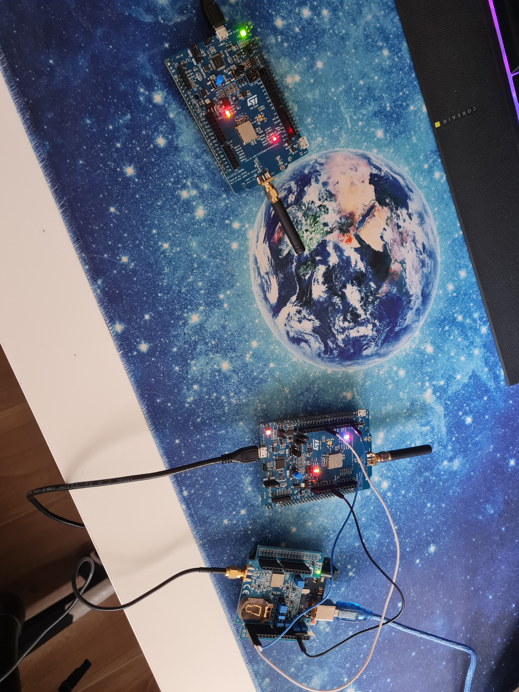
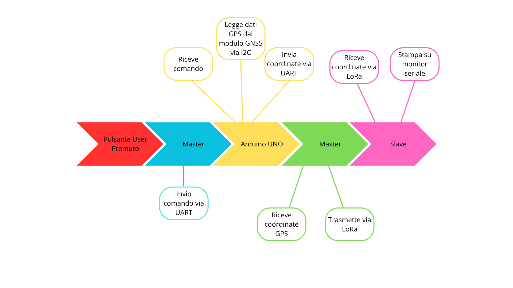
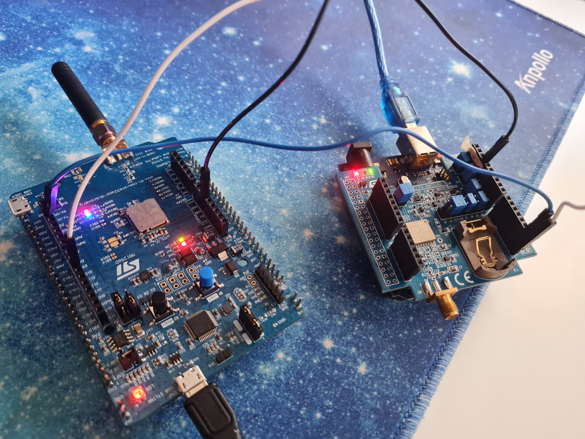

# Report - Progetto Misure per Comunicazione LoRa e Modulo GNSS

## Obiettivo del Progetto
Realizzare un sistema di localizzazione basato su microcontrollore STM32, in grado di comunicare via protocollo LoRa con due schede B-L072Z-LRWAN1 e un modulo GNSS (X-NUCLEO-GNSS1A1) montato su Arduino UNO. Il sistema consente di richiedere e trasmettere le coordinate GPS (latitudine e longitudine) su richiesta dell’utente.

## Componenti Utilizzati
- **B-L072Z-LRWAN1** (x2): una configurata come Master, l'altra come Slave
- **X-NUCLEO-GNSS1A1**: modulo GPS (Teseo-LIV3F)
- **Arduino UNO**: gestione del modulo GNSS e comunicazione UART
- **UART**: comunicazione seriale tra STM32 Master e Arduino
- **I2C**: comunicazione tra modulo GNSS e Arduino Uno
- **User Button**: pulsante fisico sulla scheda STM32 per richiesta dati GPS

## Descrizione del Funzionamento

1. **Richiesta GPS (STM32 Master)**
   - Alla pressione del pulsante USER sulla scheda STM32 (Master), viene inviata una richiesta UART all’Arduino UNO.

2. **Risposta Arduino**
   - L’Arduino interroga il modulo GNSS1A1, ottiene l'ultima latitudine e longitudine memorizzata in formato NMEA, li elabora e invia i dati GPS al Master via UART.

3. **Comunicazione LoRa**
   - STM32 Master riceve la posizione da Arduino e la inoltra via LoRa alla seconda scheda B-L072Z-LRWAN1 (Slave) che funge da gateway.

4. **Ricezione Slave**
   - La scheda Slave riceve le coordinate GPS, le memorizza e le stampa su monitor seriale.


<p align="center">
  
</p>

## Diagramma a Blocchi 

<p align="center">
  
</p>

## Flusso dei Dati

```
USER BUTTON premuto
       ↓
STM32 Master → Richiesta UART → Arduino UNO
       ↓
Arduino → Lettura GNSS1A1 + Invio UART → STM32
       ↓
STM32 Master → Trasmissione LoRa → STM32 Slave
       ↓
STM32 Slave → Ricezione coordinate GPS
```

## Comunicazione

- **UART**: configurata su **USART1** con i seguenti parametri:
  - Baud rate: `USART_BAUDRATE` -> 115200
  - Parità: **Nessuna**
  - Bit di dati: **8 bit**
  - Bit di stop: **1 bit**
  - Modalità: **Trasmissione e Ricezione**
  - Controllo di flusso: **Disabilitato (nessuno)**

  Inizializzazione effettuata con la seguente funzione:
  ```c++
  void MX_USART1_UART_Init(void)
  {
    huart1.Instance = USART1;
    huart1.Init.BaudRate = USART_BAUDRATE;
    huart1.Init.WordLength = UART_WORDLENGTH_8B;
    huart1.Init.StopBits = UART_STOPBITS_1;
    huart1.Init.Parity = UART_PARITY_NONE;
    huart1.Init.Mode = UART_MODE_TX_RX;
    huart1.Init.HwFlowCtl = UART_HWCONTROL_NONE;
  
    if (HAL_UART_Init(&huart1) != HAL_OK)
    {
      return;
    }
  }
  ```

- **I2C**: utilizzato per collegare il modulo GNSS all’Arduino UNO e permettere la lettura dei dati di posizione.

- **LoRa**: modalità **P2P (Point-to-Point)** tra le due schede **B-L072Z-LRWAN1**, una configurata come Master, l’altra come Slave.

## Collegamenti Hardware UART

Per abilitare la comunicazione UART1 tra **B-L072Z-LRWAN1** e Arduino, sono stati utilizzati dei jumper:

- **GND** collegato tra Arduino e **B-L072Z-LRWAN1**
- **RX Arduino (D0)** collegato a **TX B-L072Z-LRWAN1 (D10 (PB6) - USART1_TX)**
- **TX Arduino (D1)** collegato a **RX B-L072Z-LRWAN1 (D2 (PA10) - USART1_RX)**

Questi pin corrispondono all’interfaccia **USART1** sulla scheda **B-L072Z-LRWAN1**.  
È importante che il collegamento GND sia comune, per garantire il corretto riferimento dei segnali seriali.

<p align="center">
  
</p>

## Formato del Messaggio GPS
Esempio di messaggio ricevuto da Arduino e trasmesso via LoRa:
```
41.127441, 14.779908
```

## Codice (Estratti Logici)

### Master 
```c++
BSP_PB_Init(BUTTON_USER, BUTTON_MODE_EXTI);
...
void HAL_GPIO_EXTI_Callback(uint16_t GPIO_Pin)
{
  if (GPIO_Pin == KEY_BUTTON_PIN)
  {
    BSP_LED_Toggle(LED2);
    buttonPressed = true;             
    UTIL_SEQ_SetTask(1 << CFG_SEQ_Task_SubGHz_Phy_App_Master, CFG_SEQ_Prio_0);
  }
}
...
static void Master(void) {
    ...
    if (buttonPressed && !gpsSent)
    {
        char uartBuf[64] = {0}; 
        uint8_t ch;
        int i = 0;

        const char* cmd = "invia\n";
        MX_USART1_UART_Init(); 
        HAL_UART_Transmit(&huart1, (uint8_t*)cmd, strlen(cmd), 100);

        for (i = 0; i < sizeof(uartBuf) - 1; ++i)
        {
            if (HAL_UART_Receive(&huart1, &ch, 1, 200) == HAL_OK)
            {
                uartBuf[i] = ch;
                if (ch == '\n') {
                    ++i;  
                    break;
                }
            }
            else
            {
                break;  
            }
        }
        uartBuf[i] = '\0';  

        if (i > 0)
        {
            memset(BufferTx, 0, MAX_APP_BUFFER_SIZE);
            memcpy(BufferTx, uartBuf, i);  
            APP_LOG(TS_ON, VLEVEL_L, "Master: Invio messaggio UART (%d bytes): %s\n\r", i, uartBuf);
            Radio.Send(BufferTx, i);
        }
        else
        {
            APP_LOG(TS_ON, VLEVEL_L, "Master: Nessuna risposta valida dalla UART\n\r");
        }

        buttonPressed = false;  
    }
}
```

### Arduino - Lettura GPS e invio dati

Il programma permette di interfacciarsi con il modulo GNSS **X-NUCLEO-GNSS1A1** tramite **I2C**, utilizzando la libreria *MicroNMEA* per il parsing dei dati NMEA. Il codice è pensato per Arduino Uno e gestisce la ricezione, il parsing e la trasmissione delle informazioni di posizione.

#### Funzioni principali

- `gpsHardwareReset()`: Esegue un reset hardware del modulo GNSS tramite il pin RESET, assicurando che il dispositivo parta in uno stato noto.

  ```c++
  void gpsHardwareReset()
  {
     // reset the device
     digitalWrite(RESET_PIN, LOW);
     delay(50);
     digitalWrite(RESET_PIN, HIGH);
  
     // wait for reset to apply
     delay(2000);
  }
  ```

- `readI2C(char inBuff)`: Legge 32 byte dal modulo GNSS tramite I2C e li memorizza nel buffer passato come argomento. Serve per acquisire i dati NMEA trasmessi dal modulo.

  ```c++
  // Read 32 bytes from I2C
  void readI2C(char *inBuff)
  {
     gps.beginTransmission(DEFAULT_DEVICE_ADDRESS);
     gps.write((uint8_t)DEFAULT_DEVICE_PORT);
     gps.endTransmission(false);
     gps.requestFrom((uint8_t)DEFAULT_DEVICE_ADDRESS, (uint8_t)32);
     int i = 0;
     while (gps.available())
     {
        inBuff[i] = gps.read();
        i++;
     }
  }
  ```

- `transferPositionUART()`: funzione che trasmette *latitudine* e *longitudine* nel formato CSV, esempio: `45.123456,12.123456`

  ```c++
  void transferPositionUART()
  {
     long latitude_mdeg = nmea.getLatitude();
     long longitude_mdeg = nmea.getLongitude();
     lastLatitude = latitude_mdeg;
     lastLongitude = longitude_mdeg;
  
     console.print(latitude_mdeg / 1000000., 6);
  
     console.print(",");
      
     console.print(longitude_mdeg / 1000000., 6);
  
  
     console.println();
  }
  ```

#### setup()

Inizializza la seriale, l’I2C, i pin necessari e il modulo GNSS. Invia alcuni comandi di configurazione al modulo e imposta l’interrupt sul segnale PPS.

Il modulo GNSS emette un segnale `pps - Pulse Per Second`, che viene impostato ad alto una volta al secondo, in modo da **sincronizzare la lettura** dei dati tra l'arduino ed il modulo stesso. Di conseguenza il `pin 2` di Arduino viene configurato come *input*; allo stesso pin viene associata una **interrupt** che esegue la funzione `ppsHandler` ogni volta che il pin 2 viene impostato ad alto dal modulo GNSS (rising edge):

```c++
pinMode(2, INPUT);
attachInterrupt(digitalPinToInterrupt(2), ppsHandler, RISING);

...
    
void ppsHandler(void)
{
   ppsTriggered = true;
}
```

#### loop()

Nel noop principale si controlla se la flag `ppsTriggered` è true, nel caso in cui i dati dal modulo GNSS sono disponibili; si controlla, inoltre, se i dati rilevati dal sensore sono validi; se questi sono validi vengono salvati in una variabile di *ultima posizione conosciuta*:
```c++
if (ppsTriggered)
{
  ppsTriggered = false;
  ledState = !ledState;
  digitalWrite(LED_BUILTIN, ledState);

  // Stampa solo se fix valido e almeno 1 satellite
  if (nmea.isValid() && nmea.getNumSatellites() > 0)
  {
#ifdef DEBUG_MODE
     printPositionFull();
#else
     transferPositionUART();
#endif
  }
  nmea.clear();
}
```

Inoltre, si controlla se è presente una **richiesta di posizione** da parte del modulo LoRa via **UART**; se arriva una richiesta, vengono inviati sulla porta seriale i dati relativi all'ultima posizione conosciuta:
```c++
while (Serial.available() > 0) {
    char received = Serial.read();
    if (received == '\n') { // fine messaggio (newline)
      incomingMessage.trim(); // rimuove spazi e newline
      if (incomingMessage == "invia") {
        transferPositionUART();
      }
      incomingMessage = ""; // reset per il prossimo messaggio
    } else {
      incomingMessage += received;
    }
  }
```

**Nota**: l'ultima posizione viene stampata sia se arriva il messaggio di richiesta da parte del modulo LoRa, sia in caso contrario (in due funzioni differenti); questo per avere la percezione che la scheda GNSS sta ricevendo dati validi. 


### Slave
```c++
static void Slave(void) {
    Radio.Sleep();

    switch (State)
    {
        case RX:
            if (RxBufferSize > 0)
            {
                if (RxBufferSize < MAX_APP_BUFFER_SIZE) {
                    BufferRx[RxBufferSize] = '\0';
                } else {
                    BufferRx[MAX_APP_BUFFER_SIZE - 1] = '\0'; 
                }

                APP_LOG(TS_ON, VLEVEL_L, "Slave: Messaggio ricevuto (%d bytes): %s\n\r", RxBufferSize, BufferRx);

                UTIL_TIMER_Stop(&timerLed);
                LED_Off(LED_RED1);
                LED_Toggle(LED_RED2);

                HAL_Delay(Radio.GetWakeupTime() + RX_TIME_MARGIN + 250);

                memset(BufferTx, 0, MAX_APP_BUFFER_SIZE);
                memcpy(BufferTx, ACK, strlen(ACK));
                Radio.Send(BufferTx, strlen(ACK));
            }
            else
            {
                APP_LOG(TS_ON, VLEVEL_L, "Slave: Buffer vuoto. In ascolto...\n\r");
                Radio.Rx(RX_TIMEOUT_VALUE);
            }
            break;

        case TX:
            APP_LOG(TS_ON, VLEVEL_L, "Slave: ACK inviato. Ritorno in ascolto...\n\r");
            Radio.Rx(RX_TIMEOUT_VALUE);
            break;

        case RX_TIMEOUT:
        case RX_ERROR:
            APP_LOG(TS_ON, VLEVEL_L, "Slave: Timeout o errore in ricezione. Riprovo...\n\r");
            Radio.Rx(RX_TIMEOUT_VALUE);
            break;

        case TX_TIMEOUT:
            APP_LOG(TS_ON, VLEVEL_L, "Slave: Timeout di trasmissione. Riprovo ascolto...\n\r");
            Radio.Rx(RX_TIMEOUT_VALUE);
            break;

        default:
            Radio.Rx(RX_TIMEOUT_VALUE);
            break;
    }
}
```


